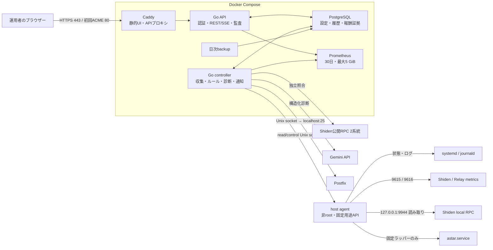

# Shiden Guardian

Shiden Guardianは、自宅で稼働するShiden Collatorノードを継続監視し、異常の証拠を集め、必要に応じて運用者へ通知する日本語Webダッシュボードです。対象は次の1台に固定されています。

- ノード名: `tk_sdn_collator`
- systemd unit: `astar.service`
- 報酬ウォレット: `WGYDjFY3JSijqBMkKEv7qfWU6XaRnmzigQG7B6G1zh7jBzN`
- タイムゾーン: `Asia/Tokyo`

単に「プロセスが起動しているか」だけでなく、finalized block、外部Shiden RPCとの差、peer数、CPU・メモリ・ディスク、journaldログ、Collatorのactive set、ブロック生成報酬まで突き合わせます。Geminiは収集済みの限定データを診断しますが、AIが作ったコマンドを実行することはありません。

Guardianが自動で行える変更は、厳しい安全条件をすべて満たした場合の`astar.service`の再起動だけです。ノード停止、バイナリ更新、OS再起動、チェーンDB修復、鍵・ウォレット・オンチェーン操作は対象外です。

## 全体構成



Composeは`caddy`、`api`、`controller`、`prometheus`、`postgres`、`backup`で構成されます。systemd操作が必要なhost agentだけをUbuntuホストで動かし、WebコンテナへDocker socket、systemd D-Bus、ホストの広いファイルシステム権限を渡しません。

## 画面と主な機能

- **概要**: service状態、uptime、バージョン、再起動回数、block、同期差、peer、ホスト資源、報酬の要点、直近インシデントを表示します。
- **メトリクス**: CPU、メモリ、peer数、同期差、ローカル・外部block高を用途別の時系列グラフで表示します。画面表示中は15秒ごとに更新します。
- **ログ**: `astar.service`のjournaldログを原文のまま検索・確認します。
- **インシデント**: ルール検知、Gemini診断、復旧・解決状態と証拠を確認します。
- **メンテナンス**: 手動再起動を、パスワード、TOTP、理由、確認、idempotency key付きで実行します。
- **設定・監査**: observe-only状態、メール・Gemini接続テスト、認証・設定・操作の監査履歴を確認します。
- **報酬**: active set、最終報酬、24時間報酬、残高、作成間隔、日別・累計報酬、block単位の検証証拠を表示します。

元ログ以外のUI・通知・AI診断は日本語です。金額と時刻は読みやすく表示し、正確なPlanck値や原時刻も確認できます。

## ノード監視と既定しきい値

| 監視対象 | 警告 | 重大 |
|---|---|---|
| `astar.service` | - | inactive/failedが60秒継続 |
| finalized block | - | ローカルが5分停止し、外部2系統がそれぞれ20 block以上進行 |
| 同期差 | 30 block超が5分 | 120 block超が10分 |
| peer | 3未満が5分 | 0が3分 |
| ディスク空き | 15%未満 | 8%未満 |
| メモリ | 90%以上が10分 | OOM検出は重大 |
| ログ | error傾向 | panic、OOM、database errorなど |

Polkadot Telemetryは状況確認用リンクとして使いますが、その内部APIや単独のblock authorship空白だけを再起動根拠にはしません。外部RPCが停止・不一致の場合も、ノード異常と決めつけず「監視データ不足」として扱います。

## ブロック生成報酬の検証

報酬監視は固定ウォレット`WGYDjFY3JSijqBMkKEv7qfWU6XaRnmzigQG7B6G1zh7jBzN`専用です。任意アドレスや任意RPCメソッドをWebリクエストから指定することはできません。

1. ローカルRPCを主系として、finalized block、active set、`CollatorSelection.LastAuthoredBlock`、報酬ポット、ウォレットのfree balanceを読み取ります。
2. Shiden公開RPC 2系統を独立した証拠として照合します。
3. 作成blockごとに、親block時点のポットから`max(pot_free - 1,000,000 Planck, 0) / 2`を整数で計算します。
4. block前後の残高増分が期待額以上なら確認済みとします。超過分は追加入金として扱い、報酬確認自体は成功です。
5. 不足やポット枯渇は、同じfinalized block hashについて2ソース以上が一致した場合だけ重大化します。

SDNは小数18桁で、`1 SDN = 10^18 Planck`です。DBでは`numeric(39,0)`、JSONでは10進文字列を使い、JavaScriptの数値精度損失を避けます。対応済みruntime specは`2208`と`2300`です。未知のruntimeやAccountInfo形式を検出した場合、金額判定を止めてfail-closedで「報酬監視劣化」と通知します。

導入前の履歴は推測しません。Activation時のfinalized blockを開始点として、以降の証拠だけを保存します。controller停止中はDB cursorから再開し、pruning等で補えない区間は監視gapとして残します。外部RPCの429や停止時はバックオフし、「報酬未取得」と誤判定しません。

active set所属中かつShiden chainが進行しているとき、最後の確認済み報酬から15分で警告、30分で重大です。active set離脱は2ソースで連続確認後に重大化します。service停止、同期停止、Shiden全体停止中は報酬メールを重複させず、既存インシデントへ「報酬取得リスク」を追加します。

**報酬系インシデントは常に自動再起動対象外です。** Geminiが再起動を提案しても自動操作へ進みません。

## Gemini診断と限定自動復旧

Geminiは安定版モデル`gemini-3.6-flash`を`store=false`、構造化出力、ツール呼び出しなしで使用します。入力は直近15分の集約メトリクス、ルール、外部block、service状態、報酬証拠、最大200件の関連ログに限定されます。送信前にIP、peer ID、ファイルパス、トークンらしき値をマスクします。

出力は`severity`、`diagnosis`、`evidence_ids`、`recommended_action`、`confidence`、`operator_steps`の固定schemaです。`recommended_action`は`none | observe | restart_service | manual_investigation`だけを受理し、AI生成コマンドは実行しません。

初期14日間はobserve-onlyです。その後も自動再起動には、次の条件がすべて必要です。

1. service停止、または外部chain進行中にローカルfinalizedが5分停止している。
2. 60秒後の再確認でも異常が続いている。
3. Geminiが`restart_service`、confidence `0.90`以上を返している。
4. 外部RPC 2系統、監視データ、SMTPが正常である。
5. ディスク重大、メンテナンス中、cooldown、回数上限、過去の復旧失敗に該当しない。
6. 運用者がobserve期間終了後にstep-up認証で自動化を有効化している。

さらにhost agentが60分cooldown、24時間最大2回、action ID重複防止、復旧失敗後の停止、root所有の緊急停止ロックを強制します。再起動後は2分以内のactiveと10分以内のblock進行を確認し、失敗時は再試行せず自動化を停止して重大メールを送ります。

## セキュリティ境界

- 公開ポートはCaddyのTCP `80/443`とHTTP/3用UDP `443`だけです。PostgreSQL、Prometheus、API、RPC、9615/9616 metricsは公開しません。
- `80`はHTTPからHTTPSへの転送とACME証明書の発行・更新に使います。HTTP-01を使う現在の構成では、証明書取得後もルーター側で閉じないでください。
- host agentの観測・制御は`/run/shiden-guardian/observe/agent.sock`と`/run/shiden-guardian/control/agent.sock`に分離します。
- Postfixは`/run/shiden-guardian/smtp/postfix.sock`経由でホストの`localhost:25`へ接続し、SMTP 25番をコンテナネットワークへ公開しません。
- restartはroot所有・引数なしの固定ラッパーだけをsudoersで許可します。リクエストからunit名やコマンドを受け取りません。
- コンテナは非root UID、read-only filesystem、capability drop、`no-new-privileges`、healthcheck、resource limit、固定image digestを使用します。
- パスワードはArgon2id、TOTP secretはAES-256-GCM、recovery code・session tokenはhashで保存します。
- CookieはSecure/HttpOnly/SameSite、セッションは12時間、CSRF対策、ログイン試行制限、セッション失効を実装しています。
- 設定変更とrestartは再認証し、結果を監査履歴へ記録します。
- Gemini key、DB password、SMTP credential、bootstrap token、暗号鍵は`secrets/`に0600/0640で保存します。`.env`やGitへ秘密値を書きません。

緊急時はホストで次を実行すると、手動・自動を含むWeb経由restartを即座に拒否します。

```sh
sudo touch /etc/shiden-guardian/automation-disabled
```

解除は原因確認後にrootでこのファイルを削除します。復旧失敗状態は`/var/lib/shiden-guardian/guard.json`にも保持され、Web UIから勝手に解除できません。

## データ保持

| データ | 既定保持 |
|---|---|
| Prometheus時系列 | 30日または5 GiB |
| journald | bootstrapで明示適用した場合14日・1 GiB |
| 監査、操作、解決済みインシデント、報酬イベント | 365日 |
| 非同期job | 30日 |
| PostgreSQL backup | 日次、7日を超えた世代を削除 |

`bootstrap-host.sh`は、指定なしでは既存journald設定を変更しません。差分を確認して`--apply-journald-limits`を付けた場合だけ14日・1 GiBを適用します。

## リポジトリ構成

```text
app/                 Next.js / Reactの日本語UI
cmd/api/             認証、REST/SSE、ログ、設定、監査
cmd/controller/      収集、ルール、Gemini、メール、復旧制御
cmd/agent/           Ubuntuホスト用の最小権限agent
internal/            認証、DB、報酬、RPC、ルール等のGo package
deploy/              Dockerfile、Caddy、Prometheus、systemd、sudoers
scripts/             WSL SSH、preflight、設定、bootstrap、Activation
tests/               静的HTML、Compose E2E、release保持テスト
secrets/.gitkeep     秘密ディレクトリの空プレースホルダー
release/             ローカル生成release（Git対象外）
```

ローカルで保持する最新成果物は`20260804T173903Z`です。

- `release/shiden-guardian-20260804T173903Z.tar.gz`
- `release/shiden-guardian-20260804T173903Z.tar.gz.sha256`
- `release/agent-20260804T173903Z/`

これはローカル成果物の情報であり、本番で現在稼働しているreleaseを保証するものではありません。本番は必ず次で確認します。

```sh
readlink -f /home/tk/shiden-guardian/current
```

## 開発環境の再構築とテスト

必要なものはNode.js 22.13以上、Corepack、pnpm、Go 1.24、Docker Desktop、WSL 2です。リポジトリは依存関係やbuild cacheを保持しないため、clone後またはcleanup後に最初に次を実行します。

```sh
corepack pnpm install --frozen-lockfile
```

代表的な検証は次の順です。

```sh
go test ./...
corepack pnpm run lint
NEXT_PUBLIC_DEMO_MODE=true corepack pnpm test
ENV_FILE=.env.example docker compose --env-file .env.example config --quiet
bash -n scripts/*.sh tests/*.sh
bash tests/prune-local-releases.sh
```

Windows側にGoを入れていない場合は、固定したGo containerで全試験を実行できます。実運用前のE2Eは専用Compose projectを作る`tests/e2e.ps1`を利用し、ほかのprojectのvolumeやcontainerを削除しないことを確認してください。

## WSLからのSSH設定

SSH運用はPowerShell版ではなくWSLへ統一しています。Docker Desktopを起動し、WSL Ubuntuでリポジトリへ移動します。

```sh
cd /mnt/c/Users/sarah/Documents/01_MyApp/on_github/collator
bash scripts/setup-ssh-wsl.sh
```

このスクリプトは次を行います。

1. `192.168.2.194`のEd25519 host keyを確認済みfingerprintと完全照合する。
2. Shiden専用・passphrase付きEd25519 keyを作る。
3. WSLの`ssh-agent`へkeyを登録する。
4. `Host shiden-collator`を`~/.ssh/config`へ設定する。
5. 必要な場合だけ、既存password認証で`from="192.168.2.0/24",restrict`付き公開鍵を登録する。

SSH password、秘密鍵、passphraseをCodex、リポジトリ、環境変数へ渡さないでください。接続確認は次です。

```sh
source ~/.ssh/shiden_guardian_agent.env
ssh -o BatchMode=yes shiden-collator hostname
```

## 新しいreleaseのstage

WSLで次を実行します。

```sh
cd /mnt/c/Users/sarah/Documents/01_MyApp/on_github/collator
bash scripts/deploy-wsl.sh
```

処理順は、読み取り専用preflight、Compose構文確認、linux/amd64 build、agent build、Web build、archive SHA-256生成、SSH転送、リモートSHA-256検証、展開、リモートpreflightです。成功した時だけ、新releaseの手動コマンドを表示します。

ローカルの`release/`は、リモートstageが完全に成功した後だけ厳密な名前の旧成果物を削除し、最新1世代を保持します。stage失敗時は直前の最新版を残します。無関係なファイルと、リモートの`/home/tk/shiden-guardian/releases/`は削除しません。リモートの旧releaseはrollback用です。

## 初回導入、更新、Activation

`deploy-wsl.sh`が表示した新release directoryへ、password認証を維持した運用者のSSH sessionで移動します。初回だけ次を実行します。

```sh
cd /home/tk/shiden-guardian/releases/<VERSION>
less scripts/bootstrap-host.sh deploy/shiden-guardian-agent.service deploy/sudoers-shiden-guardian
sudo sh scripts/bootstrap-host.sh
sh scripts/configure-release.sh
```

`configure-release.sh`にはdomain、ACME email、通知先、Gemini API keyを入力します。現在の環境ではSMTP transportに`local-postfix`を選ぶと、ホストで稼働中のPostfixへUnix socket経由で配送します。表示されるbootstrap tokenは初期管理者登録に一度だけ必要なので、安全な場所へ保存します。

既存releaseから更新する場合は、値を画面へ表示せず設定とsecretsを移行します。

```sh
sudo sh /home/tk/shiden-guardian/releases/<VERSION>/scripts/migrate-release-config.sh \
  /home/tk/shiden-guardian/current
```

host agentが変わったreleaseでは、差分とbackup先を確認してから次を実行します。これはGuardian agentとSMTP proxyだけを更新し、`astar.service`は再起動しません。

```sh
cd /home/tk/shiden-guardian/releases/<VERSION>
sudo sh scripts/bootstrap-host.sh
```

journald制限も承認して適用するときだけ`--apply-journald-limits`を追加します。

最後にActivationします。

```sh
sudo sh /home/tk/shiden-guardian/releases/<VERSION>/scripts/activate-release.sh \
  /home/tk/shiden-guardian <VERSION>
```

Activationは設定確認、DB backup、migration dry-run、Compose build/up、全healthcheck、HTTPS検証に成功してから`current` symlinkを切り替えます。途中で失敗した場合は直前のreleaseへComposeとsymlinkを自動で戻します。`astar.service`をActivationの都合で再起動することはありません。

## 日常確認

```sh
readlink -f /home/tk/shiden-guardian/current
cd /home/tk/shiden-guardian/current
sudo docker compose ps
sudo docker compose logs --tail=100 api controller caddy
systemctl --no-pager --full status shiden-guardian-agent.service astar.service
sudo journalctl -u shiden-guardian-agent.service -n 100 --no-pager
curl --unix-socket /run/shiden-guardian/observe/agent.sock \
  http://unix/v1/rewards/snapshot
```

Web UIの「設定・監査」からメールとGeminiの接続テストを行えます。非同期jobはまず`queued`、controller処理後に`completed`または`failed`として監査履歴へ記録されます。

## トラブルシュート

### Geminiテストを押しても表示が変わらない

監査履歴を更新し、`integration.test_gemini`の後に`job.test_gemini`が`completed`または`failed`になったか確認します。`queued`のままならcontroller log、失敗ならGemini key、model、外向きHTTPSを確認します。秘密値をlogへ貼り付けないでください。

### 報酬が「収集中」または「監視劣化」になる

導入直後は最初のfinalized報酬まで履歴がありません。`active set`、quorum、runtime spec、local RPC、外部2系統の状態、監視gapを確認します。RPC 429や証拠不一致は報酬未取得とは判定されません。

### host agentのsocketがない

```sh
sudo systemctl restart shiden-guardian-agent.service
sudo systemd-tmpfiles --create /etc/tmpfiles.d/shiden-guardian.conf
sudo journalctl -u shiden-guardian-agent.service -n 100 --no-pager
```

`bootstrap-host.sh`は更新前のbinary・unit等を`/var/backups/shiden-guardian/<timestamp>/`へ保存し、起動検証に失敗すると旧agentを復元します。

### HTTPS証明書を取得できない

routerのTCP 80/443 forwarding、domainのDNS、Caddy log、外向き通信を確認します。HTTP-01で更新するため、発行後もTCP 80 forwardingを維持します。家庭用routerがNAT loopback非対応でも、Activationはhostname/SNI/証明書検証を保ったままローカルCaddyへ接続して確認します。

### migrationでDB password authentication failedになる

新releaseへ古い`.env`だけをコピーせず、必ず`migrate-release-config.sh /home/tk/shiden-guardian/current`を使って`.env`と対応するsecretsを一緒に移行します。値そのものは画面へ表示されません。

### メールが届かない

`shiden-guardian-smtp-proxy.socket`、Postfix、controllerの順に状態を確認します。local Postfix構成ではSMTP user/passwordは不要です。送信元domainの配送設定と迷惑メールフォルダーも確認してください。

## 運用上の注意

- `astar.service`、firewall、RPC bind、Docker権限、journaldを無断で変更しません。
- `tk`をDocker groupへ追加したり、広範なpasswordless sudoを許可したりしません。Composeは現在のroot管理を維持します。
- Docker imageやbuild cacheの全体cleanupは、ほかのprojectへ影響するためこのリポジトリのcleanup対象外です。
- 実際の障害対応では、Guardianの診断を証拠の一つとして使い、chain全体・network・disk・DBの状況を運用者が確認してください。

